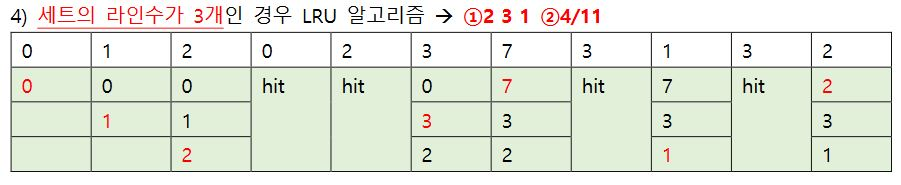
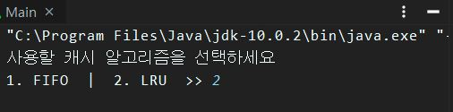
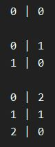
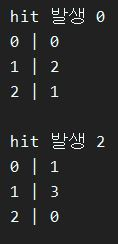
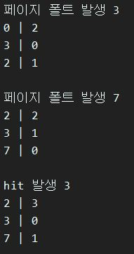
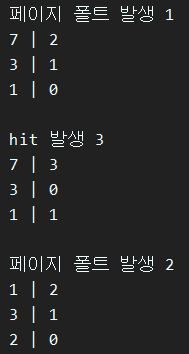
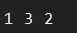

컴규터 구조 캐시 알고리즘 팀프로젝트
==================================================================
Written in Java, **이 프로젝트는 메이븐을 포함하고 있습니다.**
> 순수 자바 프로젝트는 이곳으로 -> (추후 문서화 작업 후 업로드 하겠씀미다 ㅜㅜ...)
>> 파일 다운로드는 git 또는 우측 초록색 Download를 통해 할 수 있습니다.
>>> 프로젝트 코드 보는 법            : src/main/java      폴더  
>>> 프로젝트에 사용된 txt 파일들 위치 : src/main/resources 폴더
--------------------------------------------------------------------
 4/11 = 0.3636363636.....
--------------------------------------------------------------------
**블럭 | 블럭이 사용 안된 주기**  

