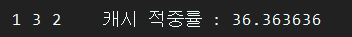

컴규터 구조 캐시 알고리즘 팀프로젝트
==================================================================
Written in Java, **이 프로젝트는 메이븐을 포함하고 있습니다.**
--------------------------------------------------------------------

